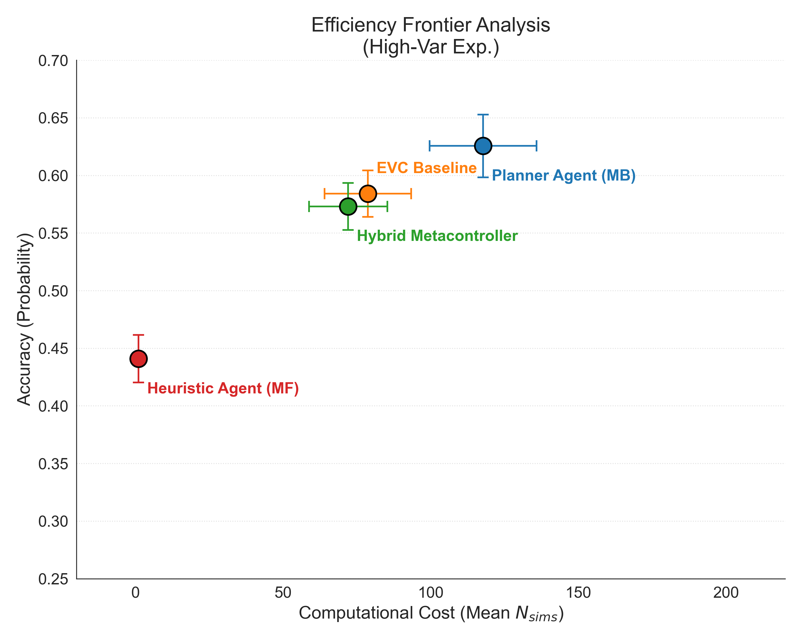
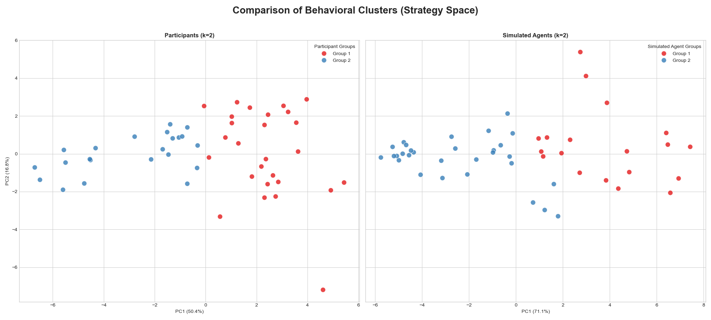
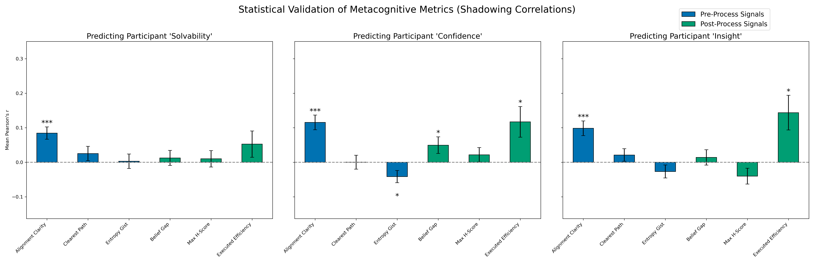
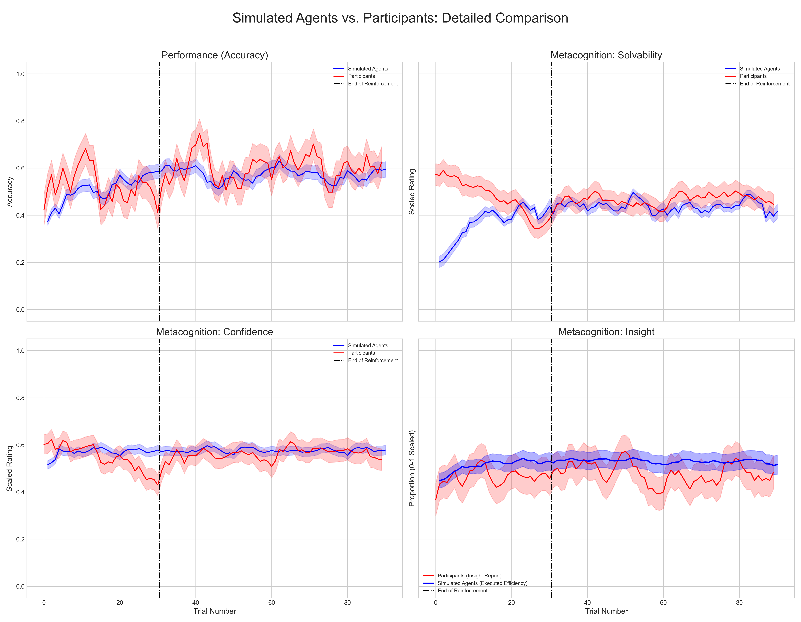
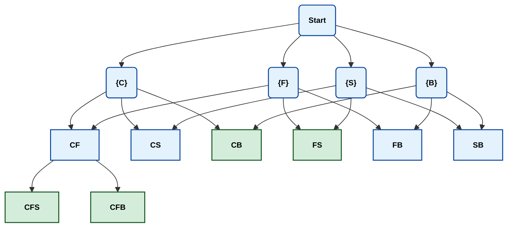
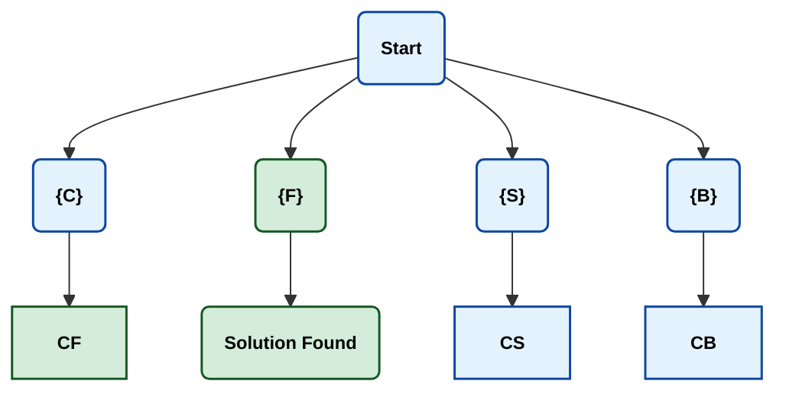

# Sparse-Reward-RL-Metacontroller

[](https://opensource.org/licenses/MIT)
[](https://www.python.org/downloads/release/python-3110/)
[]()

> ⚠️ **Note:** This repository currently serves as a showcase for the **Dual-Process Reinforcement Learning** architecture described in the associated manuscript. Source code and datasets will be made fully available upon publication.

**A modular reinforcement learning framework for modeling metacognitive control in sparse-reward environments.**

## Overview

This project implements a **Hybrid Metacontroller** that arbitrates between a fast, model-free heuristic agent (System 1) and a computationally costly Model-Based planner (System 2/MCTS).

The framework investigates **resource-rational control**, exploring how agents optimize the trade-off between computational effort and decision accuracy when external rewards are withdrawn.

## Key Features (Implemented)

* **Hybrid Metacontrol:** Arbitrates between strategies based on **Alignment Clarity** (prospective structural match) rather than just retrospective reward history.
* **Insight Latch:** Implements a **one-shot structural gating** mechanism that instantly converts discovered logical guarantees (Singletons) into cached policy weights.
* **Custom MCTS Engine:** A modular Monte Carlo Tree Search implementation supporting intrinsic information-gain rewards ($R = |C_{start}| - |C_{end}|$).
* **Asymmetric Learning:** Distinct learning rules for "World Models" (relational knowledge) and "Search Strategies" (attention weights).

---

## Performance & Validation

The framework was validated against human behavioral data ($N=49$) in a high-variability reasoning task.

### 1. Resource Rationality (The Efficiency Frontier)
The Hybrid Metacontroller (Green) occupies the optimal efficiency frontier, approaching the accuracy of a pure Planner (Blue) while reducing computational cost by **~38%**.



### 2. Strategic Fidelity (Expert vs. Novice)
Unlike standard baselines (EVC) that produce "phantom" clusters, the Hybrid model correctly recovers the distinct strategic phenotypes observed in human populations ($k=2$). It differentiates between "Experts" (who leverage structural shortcuts) and "Novices" (who rely on general search).



### 3. Internal Signal Alignment
We validated the agent's internal metacognitive signals against human subjective reports via shadowing correlations. The agent's **Alignment Clarity** and **Belief Gap** signals significantly predict human Solvability and Confidence ratings, respectively.



### 4. Temporal Dynamics (Trial-by-Trial Learning)
The agent replicates the specific time-course of human learning across 90 trials. The plots below show the agent matching human trajectories in **Accuracy** (top), **Confidence** accumulation (middle), and the rapid phase transition in **Efficiency/Insight** (bottom).



---

## The Search Landscape

The framework is tested on a high-dimensional card selection task. The agent must navigate complex search spaces where attribute informativeness varies.

### Case 1: A Balanced Problem (4:4:4:4)
*In this scenario, every attribute is equally informative as a first step, each leaving 4 valid candidates. Alignment Clarity is moderate.*



### Case 2: The "Magic Bullet" (4:1:4:4)
*In this scenario, a single informative attribute ('Filling') acts as a "Magic Bullet," immediately isolating the solution (Singleton).*



## Project Status

* **Status:** Under Review / In Prep
* **Language:** Python 3.11
* **Dependencies:** `scikit-optimize`, `numpy`, `pandas` (See `environment.yml` for anticipated requirements).

## Architecture & Usage

The core logic resides in `Metacontroller`, which arbitrates between the `AgentMCTS` (Model-Based) and `AgentHeuristic` (Model-Free) systems.

```python
from metacontroller import Metacontroller
from environment import Environment

# 1. Initialize the Dual-Process Agent
# Parameters control the arbitration logic (Hybrid) and asymmetric learning rates
config = {
    'meta_model_type': 'hybrid',
    'meta_temperature': 0.15,
    'cost_mcts': 0.8,         # Intrinsic cognitive cost
    'insight_threshold': 0.7, # Threshold for one-shot schema induction (Latch)
    'attributes': ['Colour', 'Filling', 'Shape', 'Background']
}
agent = Metacontroller(**config)

# 2. The Metacognitive Loop
# The agent observes the environment and calculates Alignment Clarity (Solvability)
env = Environment(trial_data, trial_idx=1, true_answer=0, attributes=config['attributes'])

# Step A: Arbitration (Fast vs. Slow)
# Returns the chosen system and the resource-rational sample count (dynamic_sims)
chosen_system, prob_mb, dynamic_sims = agent.choose_agent(env)

# Step B: Execution
if chosen_system == 'MB':
    # Model-Based Planner (MCTS) with dynamic compute budget
    # Driven by intrinsic information gain rewards
    candidates, path, policy, _ = agent.mb_agent.solve_one_trial(env, dynamic_n_sims=dynamic_sims)
else:
    # Model-Free Heuristic (Associative Learning)
    # Driven by cached attribute weights
    candidates, path, policy, _ = agent.mf_agent.solve_one_trial(env)

# Step C: Learning & Metacognitive Update
# Updates "World Model" (v_relation) and "Search Strategy" (v_attribute) independently
# Triggers 'Strategy Overwrite' if a Singleton is found with high confidence
agent.learn_from_trial(env, accuracy=1, search_path=path, final_candidates=candidates, 
                       trial_idx=1, agent_choice_idx=0, chosen_agent=chosen_system)
```

## Data Availability

The behavioral dataset ($N=49$) utilized in the associated manuscript allows for the validation of the following columns:

* `trial_num`: 1-90 trial index
* `actualDim`: Raw state of card layout
* `choice_vectors`: Feature vector of agent/human choice

*Note: Raw participant data is restricted due to privacy regulations. Synthetic data generators will be provided in the final release.*

## Citation

This project is licensed under the MIT License.
If you use this software or the associated architecture in your research, please cite it using the metadata provided in the CITATION.cff file.
