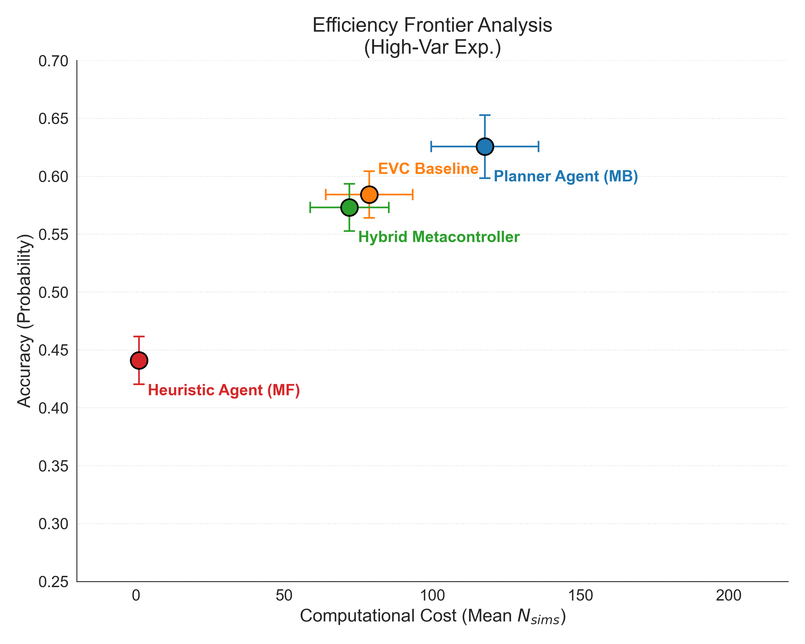
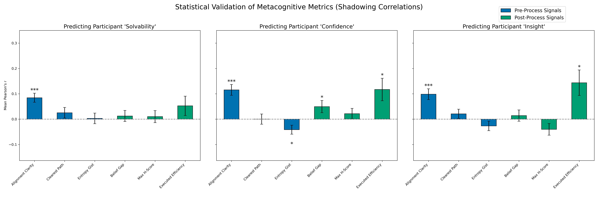
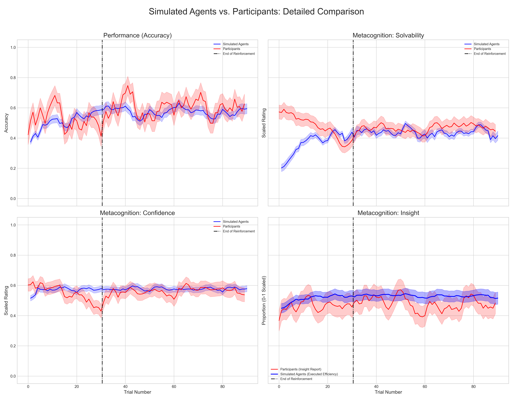
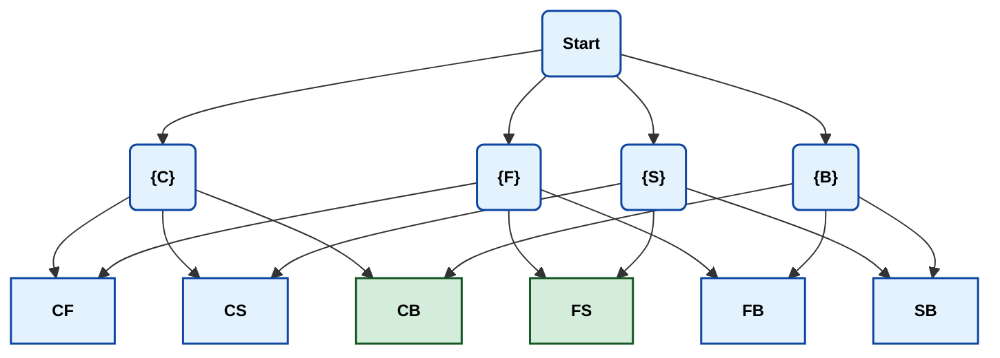

# Sparse-Reward-RL-Metacontroller

[](https://opensource.org/licenses/MIT)
[](https://www.python.org/downloads/release/python-3110/)
[]()

> ⚠️ **Note:** This repository currently serves as a showcase for the architecture described in the associated manuscript.
> Core logic files and specific fitting scripts are omitted to protect the research until formal publication.

## Overview

This framework implements a **Hybrid Metacontroller** for resource-rational agents.
The system arbitrates between a fast heuristic agent and a computationally intensive planner.
We evaluate how agents optimize the trade-off between accuracy and computational cost in environments with sparse external rewards.

## Key Features

* **Hybrid Metacontrol:** Strategy arbitration is driven by **Alignment Clarity** metrics.
* **Insight Latch:** A structural gating mechanism for rapid policy adjustment.
* **Custom MCTS Engine:** A modular planner driven by intrinsic information-gain rewards.
* **Asymmetric Learning:** Independent update rules for relational knowledge and attention weights.

---

## Performance & Validation

### 1. Resource Rationality
The Hybrid Metacontroller (Green) identifies the optimal efficiency frontier.
It maintains high accuracy while significantly reducing simulation counts compared to pure planning agents.



### 2. Internal Signal Alignment
The agent's internal metacognitive signals correlate with human subjective reports.
**Alignment Clarity** and **Belief Gap** act as prospective indicators for solvability and confidence.



### 3. Temporal Dynamics
The model replicates human learning trajectories over extended trials.
Validation includes matching accuracy, confidence accumulation, and efficiency transitions.



---

## The Search Landscape

The agent navigates high-dimensional state spaces.
Informativeness varies based on the attribute distribution of the current layout.

### Balanced Problem (4:4:4:4)

```mermaid
graph TD
    classDef default fill:#fafafa,stroke:#333,stroke-width:1.5px,color:black,font-size:12px;
    classDef stateNode fill:#e3f2fd,stroke:#0d47a1,color:black,font-weight:bold;
    classDef solutionNode fill:#d4edda,stroke:#155724,color:black,font-weight:bold;

    Start("Start") --> C("{C}"); 
    Start --> F("{F}"); 
    Start --> S("{S}"); 
    Start --> B("{B}");
    
    C --> CF; C --> CS; C --> CB;
    F --> CF; F --> FS; F --> FB;
    S --> CS; S --> FS; S --> SB;
    B --> CB; B --> FB; B --> SB;
    
    class Start,C,F,S,B,CF,CS,FB,SB stateNode;
    class CB,FS solutionNode;
```

---

## Architecture

The `Metacontroller` coordinates the interaction between the `AgentMCTS` and `AgentHeuristic`.

```python
from src.metacontroller import Metacontroller
from src.environment import Environment

config = {
    'meta_model_type': 'hybrid',
    'meta_temperature': config_param_a,
    'cost_mcts': config_param_b,
    'attributes': ['Attr1', 'Attr2', 'Attr3', 'Attr4']
}
agent = Metacontroller(**config)

env = Environment(trial_data, trial_idx=1, true_answer=0, attributes=config['attributes'])

chosen_system, prob_mb, dynamic_sims = agent.choose_agent(env)

agent.learn_from_trial(env, accuracy, search_path, final_candidates, trial_idx, chosen_agent=chosen_system)
```

## Project Structure

```text
.
├── docs/
│   └── assets/
└── src/
    ├── environment.py
    └── node.py
```

## Citation

Please refer to the `CITATION.cff` file for metadata and licensing information.
Full source code for the planners and preprocessing pipelines will be released upon publication.